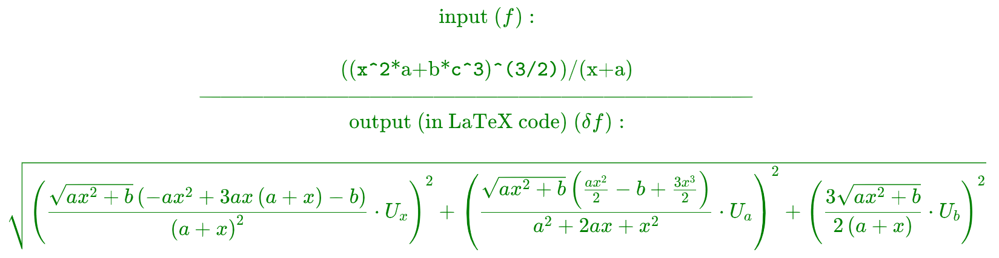

<!-- ### Hi, I'm curious how many people will actually use this repository, so if you use it and like it just leave me a star or smth. -->
<!-- make the sentence above red -->
<!--  -->
<!-- <h1> -->
Hi, I'm curious how many people actually use this repository, so if you USE it and/or LIKE it just leave me some sign of your existence:)
<!-- </h1> -->
___
# uncerainty_function_maker
The 'uncerainty_function_maker' is an application that automates the calculation of 
uncertainty $\delta f$ of a given multi-variable expression:
<!--  -->
$$
f = f(x_1, x_2, \dots, x_n)
$$
<!--  -->
Such uncertainty is commonly given by the following formula:
<!-- display Latex function -->
$$
\delta f = \sqrt{\sum_{i=1}^{n}\left(\frac{\partial f}{\partial x_i}\delta x_i\right)^2}
$$
<!-- end of Latex function -->
Where $\delta x_i$ is the uncertainty of the variable $x_i$.\
\
Most physics experiments require evaluating such equation which takes a tone of
precious time which could be nicely wasted.\
The 'uncerainty_function_maker' could come in handy in such situations.\
\
The 'uncerainty_function_maker' is able to calculate and return (in Python and LaTeX formats) the uncertainty of a given 
expression.\
For example:
<!--  -->
<!-- $$
\color{green}
\text{input }(f):\\
\quad\\
\text{((\verb|x^2|*a+b*\verb|c^3|)\verb|^(3/2)|)/(x+a)}\\
\text{------------------------------------------------------------------------------}
\quad\\
\text{output (in LaTeX code) }(\delta f):\\
\quad\\
\sqrt{\left(\frac{\sqrt{a x^{2} + b} \left(- a x^{2} + 3 a x \left(a + x\right) - b\right)}{\left(a + x\right)^{2}}\cdot U_x\right)^2 + \left(\frac{\sqrt{a x^{2} + b} \left(\frac{a x^{2}}{2} - b + \frac{3 x^{3}}{2}\right)}{a^{2} + 2 a x + x^{2}}\cdot U_a\right)^2 + \left(\frac{3 \sqrt{a x^{2} + b}}{2 \left(a + x\right)}\cdot U_b\right)^2}\\
$$ -->

<!--  -->
User can also provide (when asked by a program) to input the lists of values and uncertainties 
for each variable (if user doesn't want to provide values or uncertainties - from some point
the tables of values and uncertainties will be filled to match in length).\
For example (must be separated by SPACES):
<!--  -->
$$
\text{input }a:\\
$$
<!--  -->
$$
\text{1 2 3 4 5}\\
$$
<!--  -->
$$
\text{input }\delta a:\\
$$
<!--  -->
$$
\text{0.1 0.2 0.3 0.4 0.5}\\
$$
<!--  -->
$$
\text{input }b:\\
$$
<!--  -->
$$
\text{1 2 3 4 5}\\
$$
<!--  -->
$$
\text{input }\delta b:\\
$$
<!--  -->
$$
\text{0.1 0.2 0.3 0.4 0.5}\\
$$
<!--  -->
$$
\dots
$$
<!--  -->
It is important that the values are put into functions in the same order as
they were inputted:
<!--  -->
$$
a \in a_1, a_2, a_3, a_4, a_5\\
$$
<!--  -->
$$
\delta a \in \delta a_1, \delta a_2, \delta a_3, \delta a_4, \delta a_5\\
$$
<!--  -->
$$
\dots\\
$$
<!--  -->
$$
f_1 = f(a_1, b_1, \dots)\\
$$
<!--  -->
$$
\delta f_1 = \delta f(a_1, \delta a_1, b_1, \dots)\\
$$
<!--  -->
$$
\dots\\
$$
<!--  -->
All the values and uncertainties of the expression are calculated and saved into 
a file 'results.txt' in the same directory as the application.
<!--  -->
---------------------
# table_generator
A simple application that generates a table of a given numbers.\
\
User simply puts own data into the table '**column_values**' (manualy inside 
the python code) and adds 
column titles in '**column_names**' list (one can also add titles of rows
simply as a column of strings).\
It is also possible to choose the decimal '**separator**' (default is ',').\
\
The program returns a nicely formatted table in LaTeX format (which can be
easily copied and pasted into a REPORT or another LaTeX document).
<!--  -->
---------------------
# weighted_average
Application let's user calculate the weighted average of a given set of values
with their uncertainties.\
\
User simply puts own data into the table '**values**' (manualy inside
the python code) and adds uncertainties in '**errors**' list in the similar fashion.\
\
The program returns the weighted average of the given values with it's 
internal and external uncertainties (the bigger one of those is considered as the
final uncertainty of the weighted average).
<!--  -->
$$
\color{red}
\text{THAT'S ALL - HAVE FUN.}\\
\color{magenta}
\text{KONFABULATOR}
$$